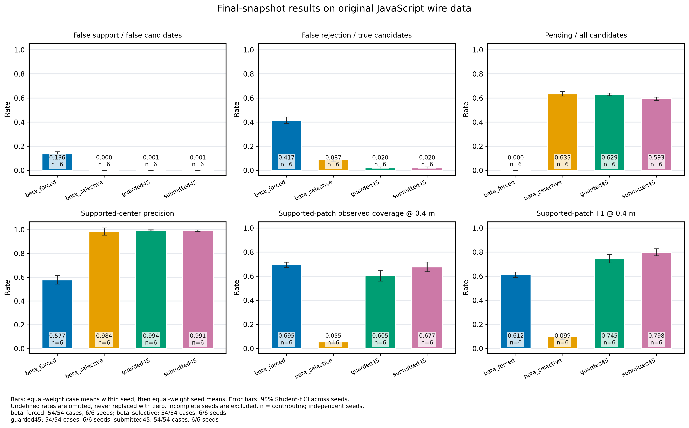

# Guarded PSPT: Method and Validation

This note records the selected research method and the **2026-10-03 Python-reference study**. Browser integration is a separate implementation: reference accuracy and Python timings must not be presented as JavaScript validation results.

The selected method is a useful development baseline. It has not solved immediate, reliable separation of real-wall points from all false hypotheses.

## Measurement Contract

The estimator consumes one snapshot at a time:

```js
{
  t: 1,
  configs: [{
    i: 1,
    j: 2,
    pHat_i: [x_i, y_i],
    pHat_j: [x_j, y_j],
    Sigma_i: [xx_i, xy_i, yy_i],
    Sigma_j: [xx_j, xy_j, yy_j],
    paths: [{ dHat: totalBistaticRange, sigmaD: rangeStandardDeviation }]
  }]
}
```

Positions and path lengths are in metres. Covariances are in square metres. Each pose has two coordinates; each symmetric covariance has three serialized entries. `dHat` is the full transmitter-to-surface-to-receiver length, not excess delay above the direct path. The path list is unlabeled.

The reference uses CPU Float64 arithmetic and a fixed 100 × 100 cell-centered grid over x = 0–80 m and y = −20–50 m. These are public numerical settings. True wall bounds and display bounds never define the search domain.

Wall side/count, actual poses, actual wall geometry, reflection locations, specular/diffuse labels, generator seed, and future snapshots are excluded from this contract. Reported noise covariance and range standard deviation are allowed; the actual noise realization is not. The current JavaScript PSPT requires strictly positive reported range standard deviations. Exact zero range noise is rejected before state changes; the legacy DRF and generator retain their original numerical contract.

## How a Candidate Is Tested

1. **Propose.** Accumulate a Direct Residual Field (DRF) from measured bistatic ranges. Extract field ridges near the measured vehicles and fit a short curved patch using at most the current and previous 11 snapshots.
2. **Construct a competitor.** Reflect the initial patch about a line fitted to measured vehicle positions. This is a geometric alternative, not a supplied opposite wall.
3. **Predict before updating.** Score the next snapshot with existing geometry and all groups' weights frozen at the start of that snapshot. Birth-fitting observations are excluded from predictive evidence.
4. **Compare four hypotheses.** Maintain weights for neither patch, the original patch, the mirror patch, and both patches. Competing groups can explain an observation; patch geometry is updated after scoring.
5. **Qualify the evidence.** Use a symmetric transmitter/receiver incidence check at the predicted reflection point. Keep the decision pending when measured noncollinearity is not distinguishable from reported pose noise, or when the candidate lacks the required observations.

The selected `guarded45` setting uses 1 m patch half-length, a 12-snapshot birth window, a 45° incidence limit, assumed miss probability 0.05, score threshold 0.99 for support and 0.01 for contradiction, and geometric gate level 0.001. A decision requires the candidate's core to be active in at least two qualified snapshots; support additionally requires a range cluster inside that candidate's core prediction gate in at least two qualified snapshots.

The pose geometry gate compares a covariance-normalized line-fit residual against an approximate chi-square threshold. It is not an exact test for general heterogeneous or anisotropic errors. Two vehicles cannot pass this instantaneous noncollinearity guard; the method does not fully exploit information from a changing trajectory over time.

`Supported`, `Pending`, and `Contradicted` describe evidence under this model. A range-gate match does not authenticate the physical source of an echo. Normalized hypothesis weights remain **uncalibrated composite scores**, including when they approach one.

## Comparison Protocol

Measurements came from the existing JavaScript wall/scattering generator. They were saved separately from evaluation truth and replayed through the Python estimators. The external prototype's independent generator was not substituted for the simulator's generator.

- **Calibration:** seeds 301–303, upper-only/lower-only/two-wall configurations, and mixed/specular/diffuse returns; 27 cases.
- **Held-out study:** seeds 501–506 and the same nine configurations per seed; 54 cases.
- **Common settings:** three vehicles, 120 snapshots, a 100 × 100 grid, and 0.1 m standard deviation for position and range noise.
- **Additional stress:** one seed with increased roughness, pose error, range error, or wall variation. These cases do not define a statistical population guarantee.
- **Scaling:** one seed with 3, 10, and 20 vehicles over 40 snapshots. This measures early-run cost, not complete 80 m reconstruction.

Selection used calibration cases and was locked before inspection of held-out truth metrics. Among eligible guarded settings, the selection target was at least 95% supported-center precision, then greater observed-wall coverage at 0.4 m. This was an empirical selection rule, not a promised error bound.

The DRF beta baselines reuse the guarded method's candidate coordinates, geometry, and histories. They compare **classification on shared candidates**, not independent end-to-end mapping systems. The forced threshold maximizes calibration mean Youden J. The selective thresholds match calibration support/rejection proportions. All thresholds remain fixed during test evaluation.

## Definitions and Denominators

- **Supported-center precision:** the fraction of supported candidate centers within 0.4 m of an actual wall, using the current candidate location at each evaluation instant.
- **False acceptance:** the fraction of off-wall candidates that are supported. This uses a different denominator from precision.
- **False rejection:** the fraction of actual-wall candidates that are contradicted.
- **Pending fraction:** the fraction of all candidates whose decision remains pending.
- **Observed-wall coverage:** the fraction of echo-observed wall samples within 0.4 m of a supported surface patch. Echo-observed samples lie within 1 m of an actual generated reflection point available through that snapshot. They are defined only for evaluation.
- **First-support error:** a candidate was off-wall when first supported, even if corrected later. Candidate movement means this is not a classification of an immutable birth point.

Both DRF-born and mirror candidates are included, including never-tested candidates. A case with no support has undefined precision; it is not assigned perfect precision. Surface sampling is approximately uniform in arc length at 0.05 m spacing. Overlapping patches count repeatedly in surface precision; center precision gives each candidate one vote.

Each seed is one statistical unit. Results average the nine conditions within each seed, then average six seed means. The 95% intervals use a Student-t interval across those six seed means. They describe between-seed variation; candidate-time rows are correlated and are not independent samples. Intervals are approximate and unadjusted for multiple comparisons.

## Python-Reference Results

All 54 cases completed for each of the four reported methods: 216 evaluations. Final precision, observed-wall coverage, and pending fraction are:

- **Guarded PSPT45, selected:** 99.39% precision, 60.45% coverage, 62.93% pending.
- **Submitted PSPT45:** 99.15% precision, 67.68% coverage, 59.32% pending.
- **DRF beta, selective:** 98.41% precision, 5.50% coverage, 63.51% pending. Precision is defined in only 34 of 54 cases; the other 20 retain zero coverage.
- **DRF beta, forced:** 57.74% precision, 69.48% coverage, 0% pending.

For the selected method, the seed-level 95% intervals are 98.98–99.79% for final precision, 55.92–64.98% for coverage, and 61.80–64.05% for pending fraction. The submitted method covers more wall but fails order/exchange checks and constructed ambiguity tests. The guard trades coverage for more conservative decisions; these results do not establish statistical superiority on every metric.

There were **25 first-support errors among 1,499 first-supported candidates**, and 25 distinct candidates were falsely supported at some time. The seed-weighted first-support precision is 98.46%, with a 97.93–99.00% interval. Its weighting differs from the pooled candidate count, so the two summaries are not exact complements.

For accepted candidates only, the mean of per-case median delays is 2.39 snapshots after birth and 1.32 snapshots after the first own-patch range-gate match. Candidates never accepted are excluded from these delay summaries and remain in pending/contradicted counts according to their current status. No physical snapshot period was defined, so these are not delays in seconds.



*Synthetic Python-reference study. These values do not establish JavaScript parity, browser throughput, real-radar accuracy, or superiority to other published systems.*

## Leakage and Causality Checks

The locked Python reference passed these executable checks on measurement wire exported from the actual JavaScript generator:

- An independently replayed prefix matches the same prefix of a longer run.
- Poisoning future observations leaves earlier results unchanged and changes later results.
- Duplicate and past snapshot indices are rejected before model/field state changes.
- Vehicle-ID relabeling, transmitter/receiver exchange, and configuration/path permutation preserve results within numerical tolerance.
- Forbidden truth keys at snapshot, configuration, and path levels are rejected before model/field state changes.
- Birth-fitting windows stop at the current snapshot; scored observations strictly follow birth.
- Estimation completes with filesystem access and calls into generator/evaluator modules blocked.

The independent 24-snapshot replay produced 76 candidate rows. The maximum relabel/permutation difference was 1.42 × 10⁻¹⁴. All 27 forbidden-key injections were rejected, with zero attempted external input reads. These checks exercise finite input paths; they are not a formal proof over every possible program input.

The browser architecture separates measurement generation, estimation, and evaluation workers. Truth may be displayed and evaluated but must never feed candidate birth, scores, thresholds, or search bounds. The JavaScript port and generated local-file bundle require their own boundary and parity checks. Passing the Python audit alone does not certify those implementations.

An independent callable audit of the JavaScript port also passed the original measurement-prefix, future-poison, ID/exchange/permutation, and 27 forbidden-field tests. Nine forbidden constructor options and 11 forbidden worker-message fields were rejected. The actual estimator worker ran in an isolated JavaScript context without file/network APIs or generator/evaluator code; its 24-snapshot output matched the direct module. Skipped snapshots and all-zero reported uncertainty were rejected without state changes. The generated local-file bundle also passed the independent callable audit, and every recorded source hash matched the current source. These executable checks are separate from visible browser behavior.

The live estimator fixes its proposal field at 100 × 100 cells, a four-standard-deviation residual band, and exact ellipse perimeter. The visible field's grid, band, and perimeter controls affect only that displayed field. Browser post-hoc sampling follows the Python evaluator: cubic wall spans and quadratic candidate patches are resampled at approximately uniform arc-length spacing of at most 0.05 m. A curved fixture matches 214 wall samples, 81 observed samples, surface precision 52/154, recall 41/81, and F1 0.40509215276458294. This checks metric implementation on a fixture; it is not a rerun of the full 54-case study in the browser.

## Remaining Failure Cases

1. **Reflection ambiguity.** Collinear vehicles can produce identical ranges for a wall and its reflected alternative. Exact and noise-only collinear fixtures stayed pending for seeds 41–43. This demonstrates conservative behavior on those fixtures, not a general observability proof.
2. **False support with real noncollinearity.** With true vehicle heights of 0, 1, and 0 m and a wall at y = 6 m, two seeds still supported false points near y = −5 m. One persisted to the end; one was transient and would be missed by final-map-only inspection.
3. **Pose-noise stress.** In a lower-wall case with 0.3 m position noise, final supported-center precision was 15/17, or 88.24%. The default-condition average is not a guarantee for noisier operation.
4. **Empty-observation support.** A candidate can cross the support threshold without a new echo when the competing hypothesis loses relative weight. This occurred in a recorded test; it is not evidence of a new positive reflection.
5. **Zero range noise.** A 20-vehicle, 40-snapshot test with zero range noise produced a covariance eigenvalue of −7.89 × 10⁻¹⁰. With only shared pose noise, the innovation covariance can be rank deficient. The current JavaScript PSPT therefore rejects exact zero range noise; no artificial jitter was added. Rank-revealing inference needs separate validation.
6. **Model mismatch.** Fixed miss probability, approximate diffuse clusters, shared pose uncertainty, finite patch extent, and an incomplete candidate set can all produce overconfident relative weights.

The next research step is stronger absolute predictive-fit and ambiguity testing without actual-wall feedback. Real measurement validation and a controlled comparison against other published systems remain open.

## Computational Scope

The Python reference's median/p95 step times in the one-seed, 40-snapshot scaling test were 0.088/0.164 s for 3 vehicles, 0.537/0.879 s for 10, and 1.696/4.511 s for 20. These timings exclude measurement generation, evaluation, and storage. They are host-dependent measurements, not browser benchmarks or a real-time deadline guarantee.

A JavaScript/Node.js v26.7.0 test with 20 vehicles and 40 snapshots at 0.1 m position/range noise completed with finite states and positive covariance eigenvalues: 0.988 s median and 2.322 s p95 per PSPT step, 47.93 s total. This was a host-dependent Node test, not a browser frame-rate measurement. [Scaling record](validation/2026-10-03/pspt-port-stress.json). The [failed zero-range-noise stress](validation/2026-10-03/pspt-port-stress-20vehicles-zero-range-noise.json) is retained; it motivated the positive-range-noise input restriction.

Cost grows with the number of vehicle pairs, range observations, grid cells, and active candidate groups. It includes grid accumulation, ridge extraction, nonlinear birth fitting, patch prediction, competition between groups, and dense shared-pose covariance updates. Explaining-away can be quadratic in active groups; a dense covariance solve can be cubic in the number of matched pairs. The Python reference also retains growing candidate histories and has a full-SVD allocation in birth fitting. A simple linear root-search estimate omits these costs.

## Reproduction and Implementation Status

Browser source checks and bundle construction are available from the repository root:

```sh
npm ci
npm run build:drf-offline
npm test
PSPT_FULL_PARITY=1 npm run test:pspt
node build-pages.mjs
```

The integration revision passed **161 automated tests on macOS/arm64, Node.js 26.7.0**, with full Python checkpoint comparison enabled. Three measured-only cases were replayed for 120 snapshots each. At checkpoints 1, 5, 15, 30, 60, and 120, all 20,394 discrete entries matched exactly; 18,540 floating entries had a maximum absolute difference of 3.77 × 10⁻¹³ (angles compared modulo 2π). The seven historical DRF fixtures also retained exact field hashes and numerical results.

The HTTP browser UI completed upper-only, lower-only, and two-wall 120-snapshot runs. View reset retained the selected snapshot and completed results. At a 1920 × 980 viewport, the default sidebar fit without vertical scrolling. The zero-range-noise setting was visibly rejected before computation. [Browser smoke record](validation/2026-10-03/browser-smoke.json). Direct `file://` visual testing was unavailable because the browser automation URL policy blocks that protocol; the committed classic-worker bundle was executed and compared in isolation instead.

Machine-readable records: [JavaScript parity](validation/2026-10-03/pspt-port-parity.json), [JavaScript and offline boundary audit](validation/2026-10-03/js-leakage-results.json), and [Python holdout summary](validation/2026-10-03/python-holdout-summary.json) ([CSV](validation/2026-10-03/python-holdout-summary.csv)). The npm parity command checks the committed measurement fixture; it does not regenerate the separate Python study.

The separate Python study used Python 3.14.3, NumPy 2.5.0, and SciPy 1.18.0 on macOS arm64. Its locked `guarded_pspt.py` SHA-256 is `5e30bb7c381232016c316f72f77636f86052970e54dc6628ea45c99f2b6b6bec`; the companion `corrected_pspt.py` SHA-256 is `401ca3b4c29d8efb868ccdde1146ba0f5048547f76ef745d7327983d1b335216`.

The complete Python experiment archive is separate from these npm commands. Repository tests do not reproduce the 54-case study. Browser test, visual inspection, and deployment records should be read as evidence for their particular source revision and environment.

Earlier [DRF method](DRF_METHOD.md) and [validation](DRF_VALIDATION.md) documents remain historical evidence. Their prior reference statistics, wall models, and MATLAB/Octave checks are not interchangeable with this PSPT study or with real-radar validation.
