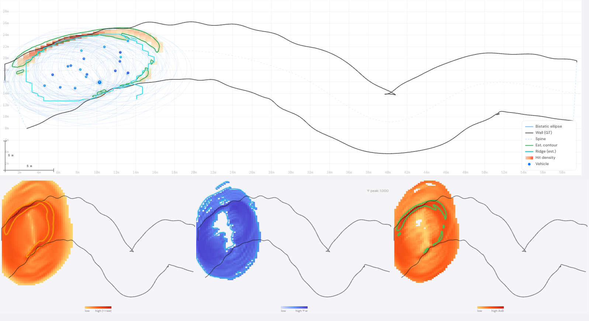

<div align="center">

<h1>EchoMap — Corridor Mapper</h1>

<p><strong>Bistatic radar tomography, reconstructed in real-time — in a single HTML file.</strong></p>

<p>
  <a href="https://woqhrl9494-cell.github.io/corridor-mapper/">
    
  </a>
  
  
  
  
</p>

<br/>



<br/>

</div>

---

## What is this?

Radars can't see through walls — but their reflections can.

**EchoMap** simulates how a network of bistatic radar nodes, mounted on moving vehicles, can reconstruct invisible corridor walls without any direct line-of-sight. Each vehicle acts as both transmitter and receiver. As radar pulses bounce off surfaces, the system accumulates thousands of *bistatic ellipses* — the geometric locus of all points that could have produced each reflected signal.

Where ellipses intersect densely, there's a wall.

This is the core idea behind **bistatic radar tomography**, and EchoMap lets you see it happen in real time — sliders, heatmaps, and all.

**Open it. Press Start. Watch walls emerge from noise.**

---

## 🚀 Try it now

**→ [woqhrl9494-cell.github.io/corridor-mapper](https://woqhrl9494-cell.github.io/corridor-mapper/)**

No installation. No dependencies. One HTML file. Works in any modern browser.

---

## How it works

```
Moving vehicles emit radar pulses
         ↓
Each pulse reflected off a wall generates a bistatic ellipse
         ↓
Thousands of ellipses accumulate on a spatial density grid
         ↓
Grid cells with high intersection density → wall candidates
         ↓
Tangent coherence filtering removes false positives
         ↓
Ridge detection extracts the final wall estimate
```

### Three-panel analysis

| Panel | What it shows |
|-------|--------------|
| **A — Density Gradient** | Raw ellipse accumulation heatmap. Orange = high density = likely wall |
| **B — Tangent Coherence** | Each cell scored by how consistently ellipses align across it |
| **A × B — Wall Score** | Combined signal. Green contours = estimated wall |

---

## ✨ Features

- **Real-time bistatic ellipse accumulation** — thousands of ellipses rendered at interactive speeds
- **Dual scenarios** — straight *Corridor* and curved *Torus* environments
- **Live evaluation metrics** — Precision, Recall, F1, Hausdorff distance, Chamfer distance, Wall Score
- **Fully parametric** — tweak wall roughness, vehicle count, radar noise, grid resolution, and more
- **Zero dependencies** — pure HTML5 + Canvas API, no build step, no npm, no frameworks
- **Single file** — the entire simulator lives in one `index.html`

---

## 🎮 Parameters

| Parameter | Description |
|-----------|-------------|
| `Seed` | Randomizes the environment geometry |
| `Gap height` | Corridor width in meters |
| `Roughness` | Wall surface irregularity |
| `Curvature` | Wall curvature (0 = flat, 1 = max curve) |
| `Vehicle Count` | Number of moving radar nodes |
| `Speed` | Vehicle speed (m/step) |
| `Spread` | Radar beam spread angle |
| `Noise` | Signal measurement noise σ |
| `Alpha` | Ellipse opacity (lower = see more accumulation) |
| `Show last N` | How many recent ellipses to render |
| `Grid G` | Spatial resolution of density grid |
| `Threshold` | Minimum density for wall candidacy |

---

## 📐 Scenarios

### Corridor
A straight corridor with configurable wall roughness and curvature. Classic indoor sensing scenario.

### Torus
A closed curved corridor forming a ring — tests the algorithm's robustness under non-linear wall geometry.

---

## 📊 Evaluation Metrics

The sidebar computes these metrics live as the simulation runs:

| Metric | Description |
|--------|-------------|
| **Precision** | % of estimated wall points within tolerance of ground truth |
| **Recall** | % of ground truth wall covered by the estimate |
| **F1 Score** | Harmonic mean of Precision and Recall |
| **Wall Score** | Peak A×B density score (coherence-weighted) |
| **Chamfer Dist.** | Mean bidirectional distance between estimate and ground truth |
| **Hausdorff 95** | 95th-percentile worst-case deviation |
| **Avg Nearest** | Mean nearest-neighbor distance from estimate to truth |
| **COH Peak** | Maximum coherence value observed |
| **Wall Cells** | Number of grid cells classified as wall |

---

## 🛠 Tech stack

| Layer | Technology |
|-------|-----------|
| Rendering | HTML5 Canvas 2D API |
| Logic | Vanilla JavaScript (ES6+) |
| Styling | CSS3 custom properties |
| Fonts | DM Sans + DM Mono (Google Fonts) |
| Dependencies | **None** |
| Build step | **None** |

---

## 📂 Structure

```
corridor-mapper/
├── index.html      ← The entire simulator (HTML + CSS + JS)
├── assets/
│   └── demo.png   ← Screenshot for README
└── README.md
```

---

## 👤 Author

**Jaebok Lee**
Hanyang University
📧 [ok7393@hanyang.ac.kr](mailto:ok7393@hanyang.ac.kr)

---

## 📄 License

© 2026 Jaebok Lee, Hanyang University

This project is licensed under [CC BY-NC-ND 4.0](https://creativecommons.org/licenses/by-nc-nd/4.0/).

- ✅ Share with attribution
- ❌ No commercial use
- ❌ No modifications or derivatives

For commercial or derivative licensing: [ok7393@hanyang.ac.kr](mailto:ok7393@hanyang.ac.kr)
