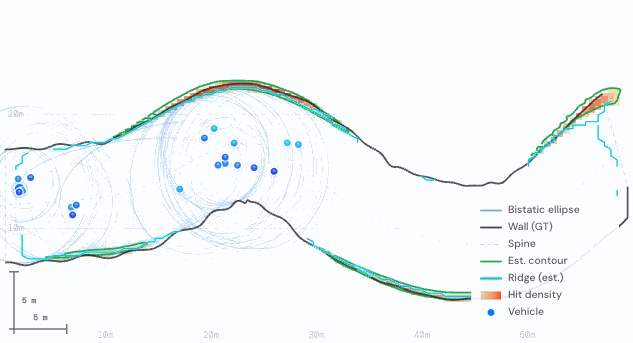

<div align="center">

<h1>EchoMap — Corridor Mapper</h1>

<p><strong>Bistatic radar wall mapping, compared head-to-head: grid accumulation vs. paper-faithful Gaussian Mixture — in a single HTML file.</strong></p>

<p>
  <a href="https://woqhrl9494-cell.github.io/corridor-mapper/">
    
  </a>
  
  
  
  
</p>

<br/>



<br/>

</div>

---

## What is this?

Radars can't see through walls — but their reflections can.

**EchoMap** simulates how bistatic radar nodes on moving vehicles reconstruct invisible corridor walls with no line-of-sight. Each vehicle pair acts as transmitter and receiver. When a pulse reflects off a surface, the set of all points consistent with that travel time traces a *bistatic ellipse* — an ellipsoid in 3D, an ellipse in 2D.

Where many ellipses intersect, there's likely a wall.

EchoMap runs **two wall-estimation algorithms in parallel** and lets you compare them live:

| Method | Idea |
|--------|------|
| **Grid Direct** | Accumulate ellipse density on a spatial grid; extract walls by ridge/NMS detection |
| **GM Paper** | Fit anisotropic 2D Gaussians to ellipse arc samples; fuse them online into a Gaussian Mixture; extract walls via Hessian ridge scoring |

**Open it. Press Start. Watch both methods converge.**

---

## 🚀 Try it now

**→ [woqhrl9494-cell.github.io/corridor-mapper](https://woqhrl9494-cell.github.io/corridor-mapper/)**

No installation. No dependencies. One HTML file. Works in any modern browser.

---

## How it works

```
Moving vehicle pairs emit radar pulses
         ↓
Each reflected pulse → bistatic ellipse (path-length locus)
         ↓
Arc-length-equalized sampling → anisotropic 2D Gaussian components
         ↓
Online Gaussian Mixture fusion (frequency-normalized, locally-first)
         ↓
Hessian ridge scoring: S_T = −n̂_T^T ∇²g̃ n̂_T   (peak at wall center)
         ↓
Temporal EMA + integer-step NMS → single-cell-thin wall estimate
```

The **Grid Direct** method runs the same ellipse accumulation but rasterises directly to a density grid, then applies threshold/ridge/NMS extraction. Both methods are evaluated against ground-truth wall geometry every 3 steps.

---

## Five-panel layout

| Panel | Label | What it shows |
|-------|-------|--------------|
| **A** | Map | Vehicle positions, bistatic ellipses, GT walls (black), Grid Direct estimate (blue), GM Paper estimate (teal) |
| **B** | Grid Direct — Density | Raw ellipse accumulation heatmap |
| **C** | GM Paper — Density | Gaussian Mixture density field evaluated on the grid |
| **D** | Grid Direct — Wall | Extracted wall mask (blue cells) with GT overlay |
| **E** | GM Paper — Wall | Hessian-ridge wall mask (teal cells) with GT overlay |

Live **Precision / Recall / F1** scores are displayed for both methods simultaneously.

---

## ✨ Features

- **Dual-method real-time comparison** — Grid Direct and GM Paper run in parallel every step
- **Paper-faithful GM algorithm** — arc-length equalization, χ̄ sensitivity weighting, γ anisotropy factor, structure tensor M_T, Hessian ridge A_T
- **Hessian ridge wall scoring** — peaks exactly at the density ridge center; eliminates the double-line artifact that gradient-based scoring produces
- **Integer-step NMS** — suppresses non-maximal Hessian values along the wall-normal direction without bilinear interpolation artifacts
- **Robust p99 threshold** — EMA of per-step 99th-percentile score; immune to single-spike instability
- **Dual scenarios** — straight *Corridor* and closed *Torus* environments
- **Randomized reset** — each Reset draws new seed, roughness, curvature, and gap for instant environment variety
- **Live evaluation** — Precision, Recall, F1, MCD, wall-cell count; updated every 3 steps
- **Zero dependencies** — pure HTML5 + Canvas API

---

## 🎮 Parameters

### Environment

| Parameter | Description |
|-----------|-------------|
| `Seed` | Corridor geometry seed (randomized on Reset) |
| `Gap height` | Corridor width in metres |
| `Roughness` | Wall surface irregularity amplitude |
| `Curvature` | Wall curvature (0 = straight, 0.5 = max) |
| `Vehicle Count` | Number of moving radar nodes |
| `Speed` | Vehicle speed (m / step) |
| `Spread` | Cross-corridor spread of vehicle formation |
| `σ_noise` | Measurement range noise std-dev (m) |
| `σ_p (position)` | Vehicle position noise std-dev (m) |

### GM Algorithm

| Parameter | Description |
|-----------|-------------|
| `η (forgetting)` | Component weight decay per step |
| `τ_p (prune)` | Minimum weight to keep a component |
| `τ_m (merge B.)` | Bhattacharyya distance threshold for merging |
| `σ_⊥ (normal)` | Initial covariance perpendicular to ellipse |
| `σ_t (tangent)` | Initial covariance along ellipse tangent |
| `Δs (arc spacing)` | Arc-length step between ellipse samples (m) |

### Wall Extraction

| Parameter | Description |
|-----------|-------------|
| `Threshold / Hessian Ridge / Outer Peak` | Grid Direct extraction mode |
| `τ_w (threshold)` | Density threshold for *Threshold* mode |
| `τ_r (ridge/NMS min)` | Ridge height minimum for *Hessian Ridge* and *Outer Peak* modes |
| `ε_g (grad bound)` | Gradient lower-bound for *Outer Peak* mode |

### Display

| Parameter | Description |
|-----------|-------------|
| `Grid G` | Spatial resolution of both density grids |
| `Panel FPS` | Rendering rate cap |

---

## 📐 Scenarios

### Corridor
A randomly generated open-ended corridor. Wall roughness and curvature are independently controllable. Vehicles traverse back and forth; every opposite pair generates ellipses.

### Torus
A closed ring corridor. Tests algorithm robustness under highly curved, fully-wraparound geometry.

---

## 📊 Evaluation Metrics

Computed every 3 simulation steps against sampled ground-truth wall points (300 pts / wall, τ = 0.9 m matching radius):

| Metric | Description |
|--------|-------------|
| **Precision** | Fraction of estimated wall cells within 0.9 m of GT |
| **Recall** | Fraction of GT points covered within 0.9 m |
| **F1 Score** | Harmonic mean of P and R |
| **MCD** | Mean Chamfer Distance (bidirectional) |
| **Wall cells** | Number of grid cells classified as wall |

---

## 🛠 Tech stack

| Layer | Technology |
|-------|-----------|
| Rendering | HTML5 Canvas 2D API |
| Logic | Vanilla JavaScript (ES6+) |
| Styling | CSS3 custom properties |
| Fonts | DM Sans + DM Mono (Google Fonts) |
| Dependencies | **None** |
| Build step | **None** |

---

## 📂 Structure

```
corridor-mapper/
├── index.html      ← The entire simulator (HTML + CSS + JS, ~3300 lines)
├── assets/
│   ├── demo.gif   ← Animated demo
│   └── demo.png   ← Screenshot for README
└── README.md
```

---

## 👤 Author

**Jaebok Lee**
Hanyang University
📧 [ok7393@hanyang.ac.kr](mailto:ok7393@hanyang.ac.kr)

---

## 📄 License

© 2026 Jaebok Lee, Hanyang University

This project is licensed under [CC BY-NC-ND 4.0](https://creativecommons.org/licenses/by-nc-nd/4.0/).

- ✅ Share with attribution
- ❌ No commercial use
- ❌ No modifications or derivatives

For commercial or derivative licensing: [ok7393@hanyang.ac.kr](mailto:ok7393@hanyang.ac.kr)
