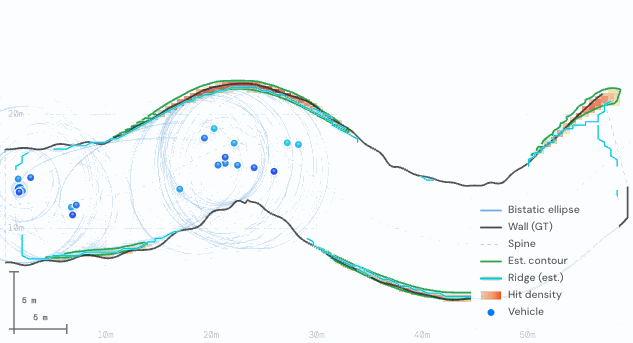

<div align="center">

# EchoMap — Corridor Mapper

**Interactive bistatic-radar wall mapping with a Grid Direct baseline and a causal local-mode ridge estimator.**

[](https://woqhrl9494-cell.github.io/corridor-mapper/)




</div>

## Live simulator

Open [woqhrl9494-cell.github.io/corridor-mapper](https://woqhrl9494-cell.github.io/corridor-mapper/), then press **Start simulation** or **Step x1**.

The page runs two estimators from the same noisy bistatic measurements:

| Method | State update | Wall extraction |
|---|---|---|
| **Grid Direct** | Raster Gaussian accumulation | Grid ridge/outer-peak extraction |
| **Revised local modes** | Bounded per-cell anisotropic modes | Analytic `E/C/R/D` gates, evidence dominance, one-cell normal NMS |

The simulator provides Corridor and Torus environments. **Reset preserves the current seed and environment parameters** so baseline/proposed comparisons are reproducible. Change a slider explicitly to select another environment.

## Revised estimator

The default estimator receives transmitter/receiver position, position covariance, noisy bistatic range, and range standard deviation. Exact simulator reflection points and ground-truth wall geometry are not estimator inputs.

### Online update

1. Sample each bistatic ellipse at approximately equal arc-length spacing.
2. Propagate pose/range uncertainty into an anisotropic Gaussian kernel.
3. Assign kernels to local modes using axial-normal alignment and Bhattacharyya distance.
4. Maintain sufficient statistics `(W,H,s,Q,O,lastSupportedSnapshot)`.
5. Count persistence once per distinct snapshot and cap each spatial cell at `K_mode` modes.

The persistent state is bounded by `O(B K_mode)`, where `B` is the number of occupied state cells.

### Analytic ridge extraction

Compatible neighboring modes define a continuous Gaussian field. Its gradient and Hessian are evaluated analytically. For field density `g`, dominant axial normal `n`, normal variance `sigma_perp^2`, and normal curvature magnitude `A`, the extractor uses:

```text
E = 2*pi*sqrt(det(P))*g
C = (lambda_1(M)-lambda_2(M))/(lambda_1(M)+lambda_2(M)+eps)
R = sigma_perp^2*A/(g+eps)
D = sigma_perp*abs(n^T grad(g))/(g+eps)
```

A candidate must satisfy the `E`, `C`, `R`, `D`, and negative-normal-curvature gates.

### Evidence dominance and causal warm-up

A weak isolated Gaussian is a trivial ridge at its own mean. These self-ridges are rejected with:

```text
E_ref = Q_0.99({E(x) > 0})
T_E   = max(tau_E, alpha(t)*E_ref)
```

`alpha(t)` is 0.60 through snapshot 60, increases linearly, and reaches 0.70 at snapshot 120. This fixed schedule uses only the current snapshot index. It does not use ground truth, metric values, coverage, or future observations.

### One-cell normal NMS

The analytic stationarity gate admits a finite band around a ridge. A normal-direction non-maximum suppression step compares each candidate with its two normal neighbors and retains the candidate with:

1. larger `E`;
2. smaller `D`;
3. lower deterministic raster index as the final tie-break.

The regression fixture reduces a two-cell band from 274 to 137 cells and reduces maximum per-column thickness from two cells to one.

## Five-panel layout

| Panel | View |
|---|---|
| **A** | GT walls, vehicles, measurements, and both wall estimates |
| **B** | Grid Direct density |
| **C** | Revised Evidence `E` |
| **D** | Grid Direct wall mask |
| **E** | Revised thin gated ridge |

Canvas backing-store size follows device pixel ratio while all overlays use logical CSS coordinates. This prevents the wall/graph displacement previously observed between Retina and external displays.

## Evaluation metrics

Metrics are updated every three simulation steps.

- Ground-truth walls are sampled uniformly by arc length at 0.2 m spacing.
- Simulator reflection hits mark the observed GT subset within a 1.0 m radius.
- Boundary tolerance is 0.4 m.
- Precision compares every prediction with the full GT wall.
- Recall measures coverage of the observed GT subset.
- Boundary F1 is the primary score.
- CA-MSD and CA-HD95 are coverage-aware directed-distance combinations. They are not labeled standard ASSD/HD95 because the two directions use different GT support.
- The UI displays observed GT coverage to expose partial-map conditions.

Exact reflection hits are evaluator-only oracle data. They never enter Grid Direct or Revised estimation.

## Data-leakage controls

- `sanitizeEstimatorMeasurements` whitelists only `tx`, `rx`, noisy `r`, and pair/sample indices.
- Grid Direct and Revised consume the same sanitized current-snapshot measurements.
- Evaluator observation state is updated only after both estimators finish.
- Evidence thresholds use current estimator state and snapshot index only.
- Unknown fields such as `hit`, GT labels, or future fields do not change mode/evidence/ridge output in the regression test.
- Seeds 42/7 were used during tuning. Parameters were frozen before testing seeds 31/87.

## Fixed-condition test snapshot

Configuration: `G=150`, 120 steps, gap 10 m, roughness 0.4, curvature 0.25, visibility OFF. Values below are from the four independent Corridor/Torus runs using test seeds 31/87.

| Metric | Grid Direct mean | Revised mean |
|---|---:|---:|
| Boundary F1 @ 0.4 m | 0.782 | 0.892 |
| Precision @ 0.4 m | 0.945 | 0.951 |
| Observed recall | 0.670 | 0.841 |
| CA-MSD | 0.640 m | 0.321 m |
| CA-HD95 | 5.219 m | 2.031 m |

This is a four-run test, not evidence of universal superiority. A paper-level result still requires a preregistered larger seed set, paired confidence intervals, and hardware-independent operation profiling.

## Runtime limitation

The Revised non-extraction update p50 is lower than Grid Direct in the tested browser runs, but analytic extraction dominates its tail latency:

```text
Grid Direct pipeline p95: approximately 8–10 ms
Revised pipeline p95:     approximately 200–273 ms
```

The current implementation therefore demonstrates better tested wall-detection accuracy, not lower total computation or real-time extraction superiority. The main bottlenecks are repeated mode-neighborhood analytic raster evaluation and sorting the positive Evidence field for the 0.99 quantile.

## Repository structure

```text
corridor-mapper/
├── index.html
├── revised_wall_estimator.js
├── wall_metrics.js
├── revised_wall_estimator.test.js
├── wall_metrics.test.js
├── data_leakage_audit.test.js
├── REVISED_ESTIMATOR_MIGRATION.md
├── ALGORITHM_UPDATE_PROMPT.md
└── assets/
```

`ALGORITHM_UPDATE_PROMPT.md` is a self-contained prompt for explaining the revised algorithm to another AI model without omitting causality, metric definitions, or runtime limitations.

## Validation

With Node.js installed:

```bash
node revised_wall_estimator.test.js
node wall_metrics.test.js
node data_leakage_audit.test.js
```

Current local results:

```text
Estimator regression: 18/18 passed
Metric regression:      5/5 passed
Data-leakage audit:     passed
```

## Author

Jaebok Lee, Hanyang University
[ok7393@hanyang.ac.kr](mailto:ok7393@hanyang.ac.kr)

## License

© 2026 Jaebok Lee, Hanyang University. Licensed under [CC BY-NC-ND 4.0](https://creativecommons.org/licenses/by-nc-nd/4.0/).
