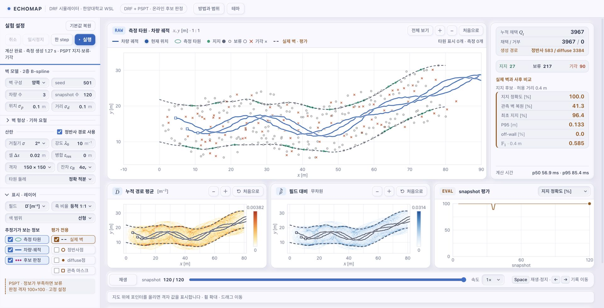
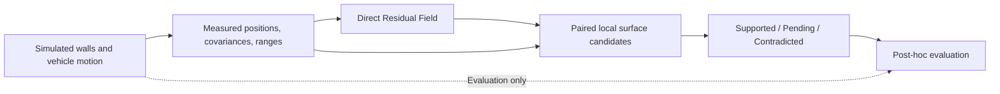

# EchoMap

[](https://github.com/woqhrl9494-cell/corridor-mapper/actions/workflows/pages.yml)
[](https://woqhrl9494-cell.github.io/corridor-mapper/drf.html)
[](LICENSE)

**Explore how unlabeled bistatic echoes support a wall map, one snapshot at a time.**

[Launch the simulator](https://woqhrl9494-cell.github.io/corridor-mapper/drf.html) / [Method and validation](PSPT_VALIDATION.md) / [License](LICENSE)

EchoMap is a browser research simulator developed by Jaebok Lee at **WSL, Hanyang University**. It generates rough, curved walls and collaborative range measurements, accumulates a Direct Residual Field (DRF), and tests local surface candidates against later measurements with a guarded Paired Surfel Predictive Test (PSPT).



*Measured echoes, field maps, and supported / pending / contradicted surface candidates in one workspace. The interface currently uses Korean labels; method documentation is in English.*

The research question is practical: when a bright field peak appears, does the next observation support a wall there, or is the peak a geometric ambiguity?

## From Echoes to Candidate Decisions


```mermaid
flowchart LR
    W[Simulated walls and vehicle motion] --> M[Measured positions, covariances, ranges]
    M --> D[Direct Residual Field]
    D --> P[Paired local surface candidates]
    M --> P
    P --> O[Supported / Pending / Contradicted]
    O --> E[Post-hoc evaluation]
    W -. Evaluation only .-> E
```

- **Asymmetric walls:** a shared center spline with independent upper and lower roughness splines, with upper-only, lower-only, and two-wall configurations.
- **Collaborative sensing:** 2–20 vehicles, specular and diffuse returns, position uncertainty, and range uncertainty.
- **Online candidate tracking:** local curved surface patches compete with constructed mirror alternatives. Unresolved candidates stay pending.
- **Inspectable experiments:** measurement geometry, accumulated fields, candidate states, snapshot replay, and separate post-hoc metrics.
- **Local execution:** computation runs in browser workers. A bundled entry supports opening `drf.html` directly from disk.

## What the Benchmark Shows

The **Python reference** was tested on 54 held-out synthetic cases: six seeds, three wall configurations, and three scattering modes. The selected guarded PSPT achieved:

- **99.4% final supported-center precision**, with a seed-level 95% interval of 99.0–99.8%.
- **60.5% coverage of the echo-observed wall** within 0.4 m, with an interval of 55.9–65.0%.
- **62.9% of candidates still pending**, with an interval of 61.8–64.1%.

There were **25 erroneous first-support decisions among 1,499 first-supported candidates**. High final precision does not erase earlier mistakes or establish complete wall recovery. Genuine noncollinear geometry and increased pose noise still produced false support in separate tests.


*Python-reference benchmark, not a JavaScript performance measurement. Error bars describe between-seed variation. Definitions, denominators, comparison scope, and remaining failures are recorded in [PSPT_VALIDATION.md](PSPT_VALIDATION.md).*

## Keep Truth Outside the Estimator

The estimator receives measured vehicle positions, reported pose covariances, total bistatic path lengths, range standard deviations, and snapshot indices. It does not receive the actual wall, wall count, selected wall side, true reflection points, path labels, or future observations.

Actual geometry belongs to measurement generation and post-hoc evaluation. Changing an actual-wall display layer must not change candidate decisions. The fixed computational domain is public configuration; display bounds derived from the actual wall must not set the estimator search area.

**A PSPT score is an uncalibrated composite model weight.** A score of 0.99 is not a 99% probability that the point is a real wall. The geometric guard is a conservative heuristic, not an identifiability theorem or an error-rate guarantee. This implementation requires positive range noise; exact zero range noise is rejected because shared pose uncertainty can leave the covariance singular.

## Run an Experiment

1. Open the [simulator](https://woqhrl9494-cell.github.io/corridor-mapper/drf.html).
2. Choose the wall configuration, vehicle count, measurement uncertainty, and scattering settings.
3. Record the seed and settings, then run or advance one snapshot at a time.
4. Replay snapshots and compare candidate states with the optional actual-wall overlay and post-hoc metrics.

The wall spans 0–80 m. The raw map initially shows −10–90 m horizontally with equal axis scales. Zoom, pan, and view reset affect the camera without resetting the experiment. Reloading generates a new seed; enter a recorded seed before running to repeat an experiment.

## Local Development

Use **Node.js 26.7.0** and npm for the recorded test environment. Historical SURF fixtures compare exact hashes from macOS/arm64; they are not portable bit-for-bit across platforms. CI preserves the full suite on macOS and separately checks the current DRF/PSPT runtime on Linux.

```sh
npm ci
npm run build:drf-offline
npm test
PSPT_FULL_PARITY=1 npm run test:pspt
node build-pages.mjs
python3 -m http.server 8871 --bind 127.0.0.1 --directory _site
```

Open `http://127.0.0.1:8871/drf.html`. To use `file://`, open the repository's `drf.html` after rebuilding the offline bundle. Rebuild the bundle whenever a runtime module changes so local-file and HTTP execution use the same source revision.

The integration revision passes **161 automated checks**, including three 120-snapshot Python-reference replays when `PSPT_FULL_PARITY=1` is set. The maximum checkpoint difference was 3.77 × 10⁻¹³; discrete decisions matched exactly. [View the numerical record](validation/2026-10-03/pspt-port-parity.json).

`npm test` checks the repository's automated tests. It does not reproduce the separate 54-case Python study or establish browser timing. Module tests, offline-bundle tests, visible browser behavior, and deployment checks are separate evidence.

## Repository and Deployment

The public entry is [`drf.html`](drf.html). Runtime modules are under [`drf/`](drf/), and numerical and regression checks are under [`tests/drf/`](tests/drf/). [`build-drf-offline.mjs`](build-drf-offline.mjs) builds the local-file bundle. [`build-pages.mjs`](build-pages.mjs) packages the public runtime, and [GitHub Actions](.github/workflows/pages.yml) deploys it from `main`.

The old home and comparison pages are excluded from the Pages artifact. Earlier research sources remain in the repository. [DRF_METHOD.md](DRF_METHOD.md) and [DRF_VALIDATION.md](DRF_VALIDATION.md) are historical records; their older results do not validate the current wall model or PSPT implementation. The [current validation note](PSPT_VALIDATION.md) separates the Python reference, browser implementation, and unresolved research questions.

## Reproduce, Inspect, Challenge

Use the exported JSON to retain settings, measurement prefixes, candidate decisions, and evaluation truth in separate fields. CSV records per-snapshot metrics and computation time. When reporting a problem, include the seed, wall configuration, vehicle count, browser version, and the first snapshot where behavior diverges. [Open a reproducible issue](https://github.com/woqhrl9494-cell/corridor-mapper/issues).

## License and Attribution

Copyright © 2026 Jaebok Lee, Hanyang University. The repository uses **CC BY-NC-ND 4.0**: attribution is required, commercial use is restricted, and the license does not permit distribution of modified material. See [LICENSE](LICENSE) for the terms and contact details for separate licensing permission.
